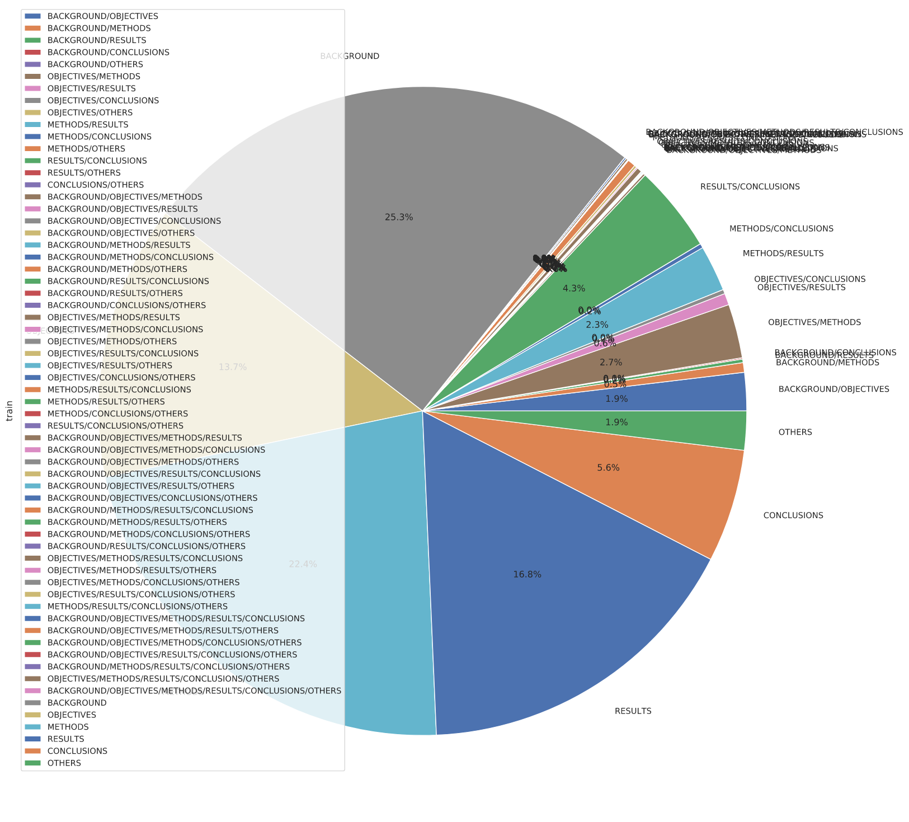
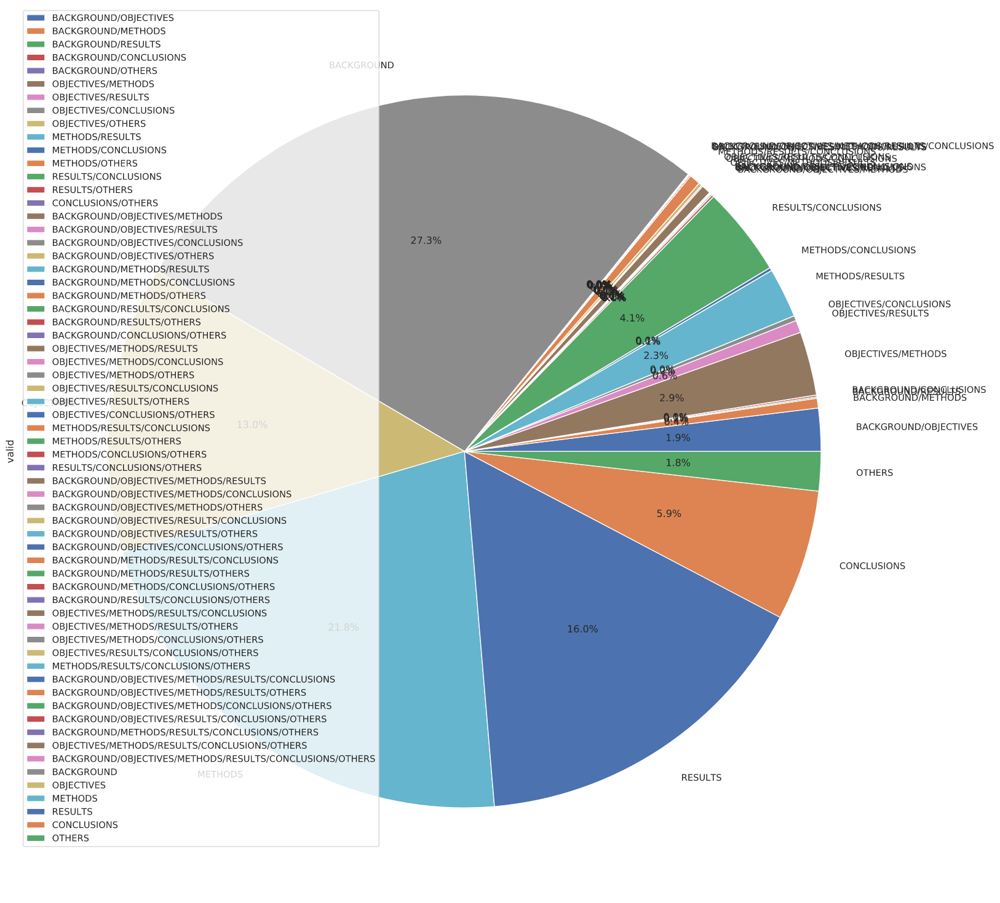

# AICUP2019
Repository for AICUP2019 Abstract Labeling test
# How to use
Type the following command to train and evaluate model
``` bash
python3 train.py
```
# Release Note
11/26 新增以下功能:
- 將hyperparameters 寫於 `hparams_setting.json` training 時自動讀取
- 將hyperparameters 紀錄於 `tensorboard`
# Note
**現在暫時不強迫config檔名不能重複 做實驗時請注意**   
**目前還沒有實做 Prediction function**  
  
11/27 
## 完成 label 分佈分析:
:::info
圖有點醜 金拍謝!
:::
#### Train label 分佈

#### Valid label 分佈

:::success
`Backgroud` 佔比最大約 25~27%
:::
## 使用 Glove 300 dimension pre trained word embedding
- embedding_dim : 300
- hiddem_dim : 600
- lrate : 1e-5
- max_epoch : 150
- batch : 16
- drop_pb : 0.4
- RNN_layers : 2
- bidirect : true

|Train F1 |Train loss |Valid F1 |Valid loss| 
|:----:   |:----:     |:----:   |:----:    |
|0.81456  | 0.48761   |0.54591  |0.53028   |
## 分析 input sequence 長度
- train:
  - min : 8
  - max : 125
  - mean : 27
- valid:
  - min : 8
  - max : 77
  - mean : 27
# Tensorboard
## Local tensorboard server
Type the following command to start tensorboard  
``` bash
tensorboard --logdir=test_experiment
```
## Use tensorboard remotely
#### Launch Tensorboard on your remote machine
```
tensorboard --logdir=path/to/log/dir --port={which port you want to use}
```
#### set up ssh port forwarding
set up ssh port forwarding to one of your unused local ports  
``` bash
ssh -Nfl localhost:xxxx:localhost:{remote tfboard port} user@remote
```
# GRU_finedtune branch info
- 現在將 sentences 從 abstract 中抽出
  - batch = 1 表示一句

### TO-DO
- [ ] **處理 OOV**
  - [ ] **移除網址**
  - [ ] **移除數字**
- [ ] 完成 Prediction function 與 Submit result
- [ ] Fine tuned Model
- [ ] Use *Transformers ( self attention )*
- [ ] Fine tuned Model  

## 開發計畫
1. **處理 OOV**
   1. **移除網址**
   2. **移除數字**
2. 重新整理 code
   1. 簡化 code  
3. Fine tuned model
4. Use *Transformers layer* 